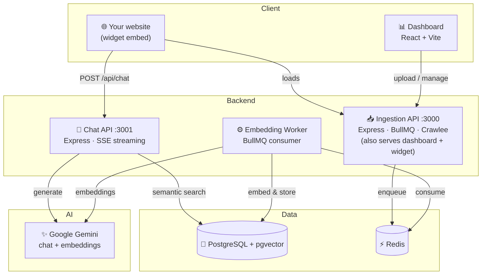

<div align="center">

# 🤖 Kira

**Open-source, self-hosted AI customer-support & sales agent — trained on _your_ data.**

[](LICENSE)
[](https://nodejs.org)
[](https://github.com/pgvector/pgvector)
[](https://ai.google.dev/)
[](CONTRIBUTING.md)

<br />

Kira is a drop-in AI support agent you embed on any website with a single `<script>` tag.
It uses **RAG (Retrieval-Augmented Generation)** over **pgvector** to answer questions grounded
in your own knowledge base — PDFs, web pages, YouTube videos, and more.

**One command to run it. Bring your own keys. Your data stays on your infrastructure.**

[Quick Start](#-quick-start) · [Features](#-features) · [Architecture](#-architecture) · [Configuration](#-configuration) · [Deploy](#-deploy) · [Contributing](#-contributing)

</div>

---

## ⚡ Quick Start

You need [Docker](https://docs.docker.com/get-docker/) and a free
[Google Gemini API key](https://aistudio.google.com/apikey). That's it.

```bash
# 1. Clone
git clone https://github.com/Rahul83100/kira.git
cd kira

# 2. Configure — copy the template and paste your Gemini key
cp .env.example .env
#    then edit .env and set:  GEMINI_API_KEY=your-key-here

# 3. Run everything
docker compose up
```

That single `docker compose up` builds and starts **all** of Kira — Postgres (with pgvector),
Redis, the ingestion API, the embedding worker, and the chat API. The database schema is applied
automatically and a **demo tenant** is pre-seeded so you can try it instantly.

| What | Where |
|:-----|:------|
| 📊 Dashboard | http://localhost:3000 |
| 🤖 Chat API | http://localhost:3001 |
| 🔑 Demo API token | `sk_demo_local_token` |

### Embed the widget

Drop this on any page and a chat bubble appears, wired to your Kira instance:

```html
<script
  src="http://localhost:3000/widget.js"
  data-token="sk_demo_local_token"
></script>
```

> **No cloud signups required.** Postgres and Redis run locally in Docker. The only key you
> _must_ provide is `GEMINI_API_KEY`. Everything else (email, Google login, payments) is optional
> and off by default — see [Configuration](#-configuration).

---

## ✨ Features

<table>
<tr>
<td width="50%">

### 🧠 AI & Knowledge
- 🔮 **RAG chat** — Gemini 2.5 Flash + pgvector semantic search
- 📄 **PDF ingestion** — upload docs, auto-chunk & embed
- 🌐 **Web crawling** — deep-crawl any site (Crawlee)
- 🎥 **YouTube transcripts** — train on video content
- 💬 **Sentiment-aware** — adapts tone to the user
- ♻️ **Streaming** — real-time responses over SSE

</td>
<td width="50%">

### 🏗️ Platform
- 🏷️ **One-line embed** — `<script>` tag, zero config
- 🫧 **Shadow-DOM widget** — zero CSS conflicts with host sites
- 📊 **Business dashboard** — docs, analytics, widget config, leads
- 🔑 **Built-in auth** — email/password out of the box (Google sign-in optional)
- 🏎️ **BullMQ job queue** — reliable background processing
- 🐘 **Bring-your-own DB** — local Postgres, or point at Supabase/Neon

</td>
</tr>
</table>

---

## 🏛️ Architecture



| Service | Port | Description |
|:--------|:----:|:------------|
| **Ingestion API** | `3000` | Document ingestion (PDF/URL/YouTube/crawl) + serves the dashboard & widget |
| **Chat API** | `3001` | RAG-powered AI responses streamed over SSE |
| **Embedding Worker** | — | Background BullMQ processor that chunks & embeds content |
| **Dashboard** | `3000` (Docker) / `5173` (dev) | React UI to manage docs, leads, analytics & widget |
| **Widget** | served at `/widget.js` | Embeddable Shadow-DOM chat bubble |

---

## 🛠️ Tech Stack

| Layer | Technology |
|:------|:-----------|
| Runtime | Node.js 20, Express |
| AI / Embeddings | Google Gemini 2.5 Flash · `text-embedding-004` (768-d) |
| Vector DB | PostgreSQL 16 + pgvector (HNSW index) |
| Cache & Queue | Redis 7 + BullMQ |
| Crawling | Crawlee + Puppeteer + Cheerio |
| Dashboard | React 19 + Vite + Tailwind CSS |
| Widget | Vanilla JS + Shadow DOM |
| Auth | Email/password (JWT) · Firebase Google sign-in (optional) |
| Email | Resend (optional) |

---

## ⚙️ Configuration

All configuration is via environment variables — see [`.env.example`](.env.example) for the full,
commented reference. The short version:

| Variable | Required? | Purpose |
|:---------|:---------:|:--------|
| `GEMINI_API_KEY` | ✅ **Yes** | Chat responses + embeddings |
| `DATABASE_URL` | Docker: auto | Postgres connection (injected by Compose) |
| `REDIS_URL` | Docker: auto | Redis connection (injected by Compose) |
| `ANTHROPIC_API_KEY` | Optional | Claude fallback for chat |
| `RESEND_API_KEY` | Optional | Send signup/lead emails (else codes print to logs) |
| `VITE_FIREBASE_*` | Optional | Enable Google sign-in (else email/password) |
| `VITE_RAZORPAY_KEY_ID` … | Optional | Payments/billing (off by default) |

**Without email configured**, signup still works — the verification code is printed to the
server logs (`docker compose logs app`). **Without Firebase**, the dashboard uses email/password.

---

## 🧑‍💻 Local development (without Docker for the app)

Prefer to run the Node services natively (hot-reload) while keeping infra in Docker:

```bash
# Start just Postgres + Redis
docker compose up -d postgres redis

# Install deps for every service
bash install-all.sh

# Apply the schema (+ optional demo seed)
npm run db:schema
npm run db:seed        # optional demo tenant

# Run all Node services + the Vite dashboard (http://localhost:5173)
npm run start:all
```

---

## 🚀 Deploy

Kira is just containers, so it runs anywhere Docker does (Railway, Render, Fly.io, a VPS, etc.).

```bash
# Build the all-in-one image
docker build -t kira .

# Run a service (point DATABASE_URL / REDIS_URL at your managed instances)
docker run -p 3000:3000 --env-file .env kira node src/index.js
```

For production, supply your own managed **PostgreSQL with pgvector** (e.g. Supabase, Neon) and
**Redis** (e.g. Upstash), set `DATABASE_URL` / `REDIS_URL` accordingly, and apply
[`db/schema.sql`](db/schema.sql).

---

## 📂 Project structure

```
kira/
├── src/                  # Ingestion API + embedding worker (port 3000)
│   ├── routes/           #   documents, auth, client, usage, onboarding…
│   ├── services/         #   chunker, crawler, embedder, retrieval…
│   ├── workers/          #   BullMQ embedding worker
│   └── db/               #   db client + historical migrations
├── sandra-chat-api/      # Chat API — RAG + Gemini streaming (port 3001)
├── dashboard/            # React dashboard (Vite) + public/widget.js
├── db/
│   ├── schema.sql        #   consolidated self-host schema (vanilla Postgres)
│   └── seed.sql          #   demo tenant
├── docs/                 # API collection & docs
├── docker-compose.yml    # one-command full stack
├── Dockerfile            # all-in-one app image
└── .env.example          # configuration reference
```

---

## 🧩 Open-core

This repository is the **open-source core** of Kira, licensed under AGPL-3.0 — the full
self-hostable product: ingestion, RAG chat, the embeddable widget, and the dashboard.

Some operational/commercial pieces (the hosted multi-tenant admin console, managed billing,
and our cloud infrastructure) are **not** part of this repo. You never need them to self-host —
billing is a no-op unless you wire up your own payment keys.

---

## 🤝 Contributing

Contributions are very welcome — bug fixes, features, docs, anything. See the
[Contributing Guide](CONTRIBUTING.md). Good entry points are issues tagged
[`good first issue`](https://github.com/Rahul83100/kira/labels/good%20first%20issue).

1. Fork → create a branch (`git checkout -b feat/your-feature`)
2. Commit (`git commit -m "feat: add your feature"`)
3. Push and open a Pull Request

Found a security issue? Please see [SECURITY.md](SECURITY.md) — don't open a public issue.

---

## 📄 License

Kira is licensed under the [**GNU Affero General Public License v3.0**](LICENSE).
You may use, modify, and distribute it freely. If you run a modified version as a network
service, you must make your source available under the same license.

---

## ⭐ Star history

If Kira is useful to you, a star genuinely helps others find it. 🌟

[](https://star-history.com/#Rahul83100/kira&Date)

<div align="center">
<br />
Built with ❤️ and too much ☕
</div>
